# 智慧健康陪伴機器人 - 系統化架構整理

## I. 核心記憶體系 (Core Memory System)

系統採用三層式記憶結構，以兼顧回應速度、對話連貫性與深度個人化。

### 1.1 短期記憶 (Short-Term Memory, STM)
* **儲存體**：**Redis** (使用 List 結構)
* **內容**：最近 N 輪對話的完整記錄 (JSON 格式)。
* **生命週期**：透過 Redis 的 **TTL (Time-To-Live)** 機制管理，例如閒置 30 分鐘後自動過期。
* **用途**：
    * 在每輪對話中，將**最近的數筆 (如 5-10 筆) STM** 注入 Prompt，作為即時的對話上下文，不塞入全部紀錄，避免浪費 Context Window。
    * 作為生成 LTM 的原始資料來源。

### 1.2 長期記憶 (Long-Term Memory, LTM)
* **儲存體**：**Milvus**
* **內容**：由 STM 總結出的結構化對話摘要**文字**，及其對應的**向量**。
* **生命週期**：永久保存。
* **用途**：透過 **RAG**，讓機器人能「主動回憶」過去的特定對話細節。

### 1.3 使用者畫像 (User Profile)
* **儲存體**：**MongoDB** 或 PostgreSQL (JSONB 欄位)
* **內容**：從 LTM 中進一步提煉出的、關於使用者的**長期性、關鍵性事實** (Key-Value 格式)。例如：家庭狀況、近期病況、近期重要事件等。
* **生命週期**：永久保存，並會隨著新的 LTM 產生而動態更新。
* **用途**：作為「**動態客製化指令**」，在每次對話中都完整注入 Prompt，讓 AI 的回覆貼近使用者的個人情境與性格，實現深度個人化。

---

## II. Agent 職責與協作流程

系統的運作由三個即時 Agent 和兩個背景 Agent 協同完成。

### 2.1 即時回應流程

#### a. 守衛 Agent (Guardrail Agent)
* **職責**：確保對話的安全與合規性，執行**輸入**與**輸出**兩道審查。
* **Prompt 模板**：
    * **輸入審查**：
        ```
        請嚴格檢查以下文字是否包含危險、違法或不當內容：'{query}'。
        如果安全，只回覆 'OK'；如果危險，回覆 'BLOCK: <原因>'。
        ```
    * **輸出審查**：
        ```
        請檢查以下由 AI 生成的回覆是否包含任何醫療建議、預測性言論或違反角色設定的內容：'{response}'。
        如果合規，只回覆 'OK'；如果不合規，回覆 'REJECT: <原因>'。
        ```

#### b. 路由分配 Agent (Router Agent)
* **職責**：分析使用者意圖（轉換 query）、判斷是否執行 RAG。
* **Prompt 模板**：

    ```
    你是一個對話意圖分析專家。根據以下對話歷史與最新問題，判斷是否需要查詢資料庫來輔助回答。
    對話歷史：{stm_history}，使用者畫像：{profile_data}，最新問題：'{query}'。
    回傳一個 JSON，包含 'search_type' ('KNOWLEDGE_KB' | 'LTM_SUMMARY' | 'NONE') 和 'query' (用於檢索的查詢語句)。
    ```

#### c. 生成回應 Agent (Companion Agent)
* **職責**：整合所有上下文，生成最終的、符合人設的回覆。
* **Prompt 模板**：

    ```
    你是一位溫暖的健康關懷助理「金孫」。基於你的角色，綜合以下所有資訊，生成自然且有幫助的回覆。
    若需提供知識性回覆，僅能使用下列[相關檢索資訊]作為知識來源回答，且不得提供任何醫療診斷或治療建議。若檢索內容不足以回答，請回覆：「我在衛教資料中查無相關資訊，無法提供醫療建議，建議聯繫醫療人員。」

    [使用者畫像]: 
    {profile_data}

    [近期對話歷史]: 
    {stm_history}

    [相關檢索資訊]: 
    {rag_results}

    [使用者最新問題]: 
    '{query}'
    ```

### 2.2 非同步背景流程

#### a. LTM 總結 Agent (Summarizer)
* **職責**：在對話閒置或達到長度閾值時，將 Redis 中的 STM 總結為 LTM，向量化後將文字與向量一併寫入 Milvus。
* **Prompt 模板**：
    ```
    你是一位專業的醫療紀錄分析師。
    將以下對話歷史總結成一份結構化的 JSON 摘要，須包含 'main_symptoms', 'key_concerns', 'mood', 'summary_text' 欄位。
    對話內容：{full_stm_text}
    ```

#### b. 事實提取 Agent (Profiler)
* **職責**： 緊接在 LTM 總結之後，負責從新生成的 LTM 摘要中，提煉出可用於更新使用者畫像的關鍵事實。
* **Prompt 模板**：
    ```
    你是一位個案管理師。
    從這份新的對話摘要中，抽取出關於使用者的長期性、關鍵性事實（如家庭、慢性症狀、未來事件等），更新既有的使用者畫像。
    摘要：{ltm_summary_json}。
    既有使用者畫像：{profile_data}。
    以 Key-Value JSON 格式回傳你認為應該新增或更新的事實。
    ```

### 2.3 主動關懷流程
* **觸發**： 由外部排程系統定時啟動，腳本內部可加入隨機延遲。
* **執行內容**：
    1.  腳本遍歷需要關懷的使用者列表。
    2.  對於每個 `user_id`，從 **MongoDB** 讀取**使用者畫像**，並從 **Milvus** 讀取**最近幾筆 LTM**。
    3.  將這些資訊填入一個固定的「主動關懷 Prompt 模板」。
    4.  呼叫 **Companion Agent** 生成關懷訊息。
    5.  訊息通過**輸出端 Guardrail** 審核後，透過 LINE API 發送。

---

## III. 流程圖

```mermaid
graph TD
    subgraph "即時同步流程"
        A("🧑‍🦳 使用者發送訊息") -- HTTP POST --> B("⚙️ 後端應用接收");
        B -- "安全過濾 (Input)" --> C{🛡️ Guardrail Agent};
        C --> D{風險檢查};
        D -- "是 (BLOCK)" --> E("🚨 回覆錯誤/警示");
        D -- "否 (OK)" --> F["<b style='font-weight:bold;'>準備上下文</b>"];
        subgraph " "
            style F fill:none,stroke:none
            F --> F1["📚 從 Redis 讀取 STM"];
            F --> F2["💾 從 MongoDB 讀取 Profile"];
        end
        F1 -- "近期對話歷史" --> G{🧠 Query Router Agent};
        F2 -- "使用者畫像" --> G;
        B -- "最新問題 Query" --> G;
        G -- "意圖分析<br/>(基於 STM+Profile+Query)" --> H{決策：是否需要 RAG?};
        H -. "是 (RAG)" .-> I["<b style='font-weight:bold;'>支線任務:</b><br/>查詢 Milvus (LTM/衛教)"];
        H -- "否 (No RAG)" --> J["<b style='font-weight:bold;'>組合基本上下文</b><br/>(STM+Profile+Query)"];
        I -. "RAG 檢索結果" .-> K{"<b style='font-weight:bold;'>組合最終 Prompt</b>"};
        J --> K;
        K -- "注入完整上下文" --> L{"✍️ Companion Agent"};
        L -- "完整 prompt" --> M("✨ 呼叫 LLM 核心");
        M -- "返回草稿回覆" --> N{🛡️ Guardrail Agent};
        N -- "安全過濾 (Output)" --> O["✅ 取得最終合規回覆"];
        O -- "原子性狀態更新" --> P["📚 將 Query & 回覆寫入 Redis"];
        P --> Q("⚙️ 透過 LINE API 回覆");
        Q --> R("🧑‍🦳 使用者接收回覆");
    end
    subgraph "非同步背景流程"
        R -- "STM 過長/對話閒置觸發" --> S{"📝 Summarizer"};
        S -- "讀取完整 STM" --> T["📚 從 Redis 讀取 STM"];
        T -- "將 STM 注入 prompt 模板" --> U["✨ 呼叫 LLM 核心"];
        U -- "返回摘要 (LTM)" --> AA["✨ 呼叫 embedding 模型<br>向量化"];
        AA -- "返回 LTM + 向量" --> V["🗄️ 將 LTM + 向量寫入 Milvus"];
        U -- "返回摘要 (LTM)" --> W["🕵️ 提取 Profile 事實"];
        W -- "將既有 Profile + LTM 注入 prompt 模板" --> X["✨ 呼叫 LLM 核心"];
        X -- "返回 Key-Value 事實" --> Y["💾 更新 Profile 至 MongoDB"];
        Y & V --> Z["🗑️ 清理 Redis 中已處理的 STM"];
    end
    classDef agent fill:#FFE6CC,stroke:#D69E3A;
    classDef db fill:#E1D5E7,stroke:#9673A6;
    classDef logic fill:#DAE8FC,stroke:#6C8EBF;
    classDef user fill:#D5E8D4,stroke:#82B366;
    classDef decision fill:#FFF2CC,stroke:#D6B656;
    classDef llm fill:#F8CECC,stroke:#B85450;
    class C,L,N,S,W agent;
    class G agent;
    class T,P,F1,F2,V,Y,Z db;
    class M llm;
    class U llm;
    class X llm;
    class AA llm;
    class A,R user;
    class B,Q,E,O logic;
    class D,H decision;
    class I,J,K logic;

```
